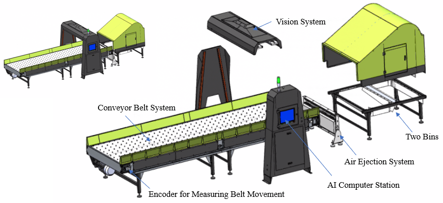

# Fast Visual Identification and Sorting of Mixed Solid Waste for Recycling

This repository will provide experiment videos for our waste sorting robot.

### Fast Visual Identification and Sorting of Mixed Solid Waste for Recycling

Accurate and efficient sorting of diverse mixed solid waste is essential for maximizing recycling rates and reducing environmental impact. We present a robotic waste sorter designed for rapid identification and sorting, employing an affordable CCD array camera and a cost-effective air jet device. After detecting waste items using deep learning models and tracking their positions, precise control of the air jet nozzles ensures the accurate ejection of waste items into assigned bins, considering both their positions and sizes. Physical tests on our robot demonstrate its capability to operate at a high belt speed of 4 m/s, achieving a remarkable air ejection accuracy of 100\%. The waste detection model, trained on our self-collected dataset, exhibits outstanding performance in detecting 14 categories of solid waste on the test set, with a F1 score exceeding 95\% at a confidence threshold of 0.7. These findings highlight the efficiency and reliability of our robotic waste sorting system. The experimental videos can be accessed at https://github.com/JiatongBao/FastVisualSorting.

<!--  -->

Fig.1 Overview of the structure of our robotic waste sorter. The robot comprises a conveyor belt system, a vision system, an air ejection system, an AI computer station, and two collection bins.

## Contact
If you have any questions, please let me know: [Jiatong Bao] jtbao[at]yzu[dot]edu[dot]cn